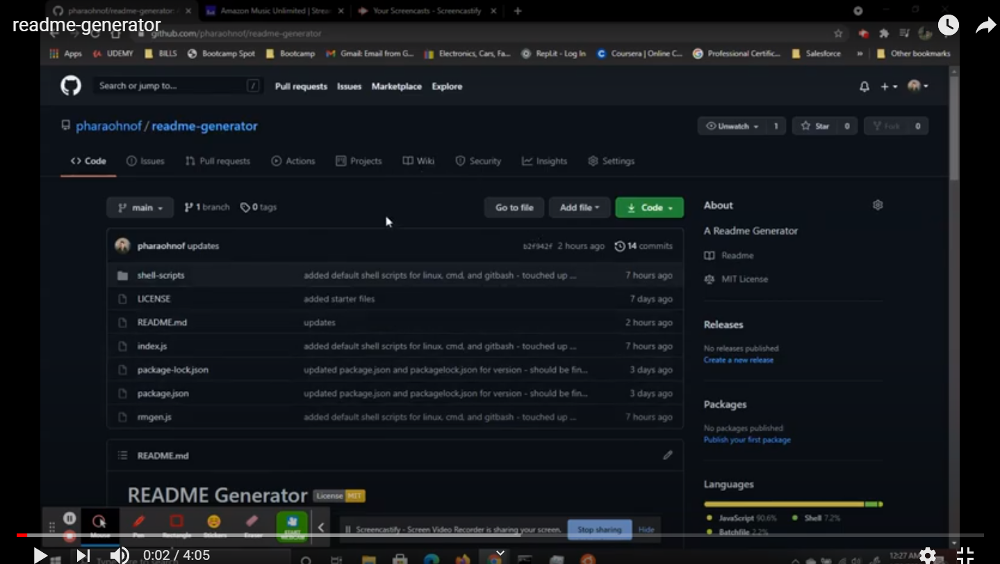

#  README Generator   

  ##  Description

***

  This project was created in order to easily generate README markdown files for GitHub projects from the command line. It uses NODE.js with Inquirer and FS to take in input from a series of questions, which is then written to a README markdown file in the current directory. Included are shell scripts for Linux bash, Powershell, and CMD, all of which will allow you to run the program from any directory on your machine.
  
  ## Table Of Contents  

***
  * [Description](#Description)
  * [Table Of Contents](#table-of-contents)
  * [Installation](#Installation)
  * [Usage Instructions](#usage-instructions)
  * [Contribution Guidelines](#contribution-guidelines)
  * [Testing Instructions](#testing-instructions)
  * [License](#License)
  * [Questions?](#questions)

  ##  Installation

***

  ### Clone the repository: 
    git clone https://github.com/pharaohnof/readme-generator.git  
      
  ### Dependencies:  
  The following dependencies are required for use:  
  * NODE.js   - Inquirer npm package  - FS npm package
    
  ### Additional Installation Instructions:
  Node.js is required to run this application, install it from your preferred package manager. Clone the above repository to your directory of choice. If you wish to use the included shell scripts to run the application from any directory, it is recommended to clone the repo to the following directories:  
  * Linux: `/home/readme-generator/`  
  * Windows: `C:\"program files"\readme-generator\`  
  * Gitbash for Windows: `/c/'program files'/readme-generator/`.  
      
  If you choose another directory and want to use the shell scripts, you will need to change the referenced directory in the scripts.  
    
  Once the repo has been cloned, navigate to the specified directory and run `npm install` to install the required dependencies.

  
  *Optional -- to use the shell scripts you must include the file in your PATH. Use `rmgen.cmd` for Powershell and CMD, and `rmgen` for Linux and other bash.*
  - Linux -bash (or Windows Sunsytem for Linux) : `/usr/bin/` is a common location in PATH for scripts
  - Windows - Powershell or Command Line : `C:/Windows/System32` is commonly in PATH
  - Gitbash for Windows : `/c/'program files'/Git/usr/bin` is in PATH
    
  ##  Usage instructions  

***
It is advised that you change the name of this file (README.md) to another name, as using this application will produce a file named README.md in this directory and overwrite any previous files of the same name.

Once the repo is cloned the application may be ran from the installed directory by running `node rmgen.js` from the command line. the program my also be optionally run from the installed directory by running `node index.js` from the command line (this was included to satisfy a user story requirement, but is not necessary.) Both of these options will produce a markdown file named README.md in the repo directory. The readme file will be filled with input from a command line inquiry.

*Optional -- if you have installed the shell scripts to a directory in your PATH then you can run this application from any directory by entering `rmgen` in the command line. Using this option will produce the README.md file in whatever directory it is ran from. In Linux You may need to change file permissions to run the script, for most users 755 will work fine. navigate to the directory where the script is located and run `chmod 755 rmgen` from the command line.*

See attached instructional video:

 
    
  ##  Contribution Guidelines  

***
    
  If you would like to contribute to this project, please [add me on GitHub](https://github.com/pharaohnof)    
  ##  Testing Instructions  

  ***
    
  **N/A**  
    
  ##  License

  ***
      
  This project is covered under the  license.  
    
  See attached [LICENSE](./LICENSE) file for details.  
    
  ##  Questions?  

  ***
  
  If you have any questions regarding this application you can reach me using the below contact information:  
  ### Contact Info  
    
  GitHub: [pharaohnof](https://github.com/pharaohnof)

  Email:  pharaohnof.software@gmail.com  